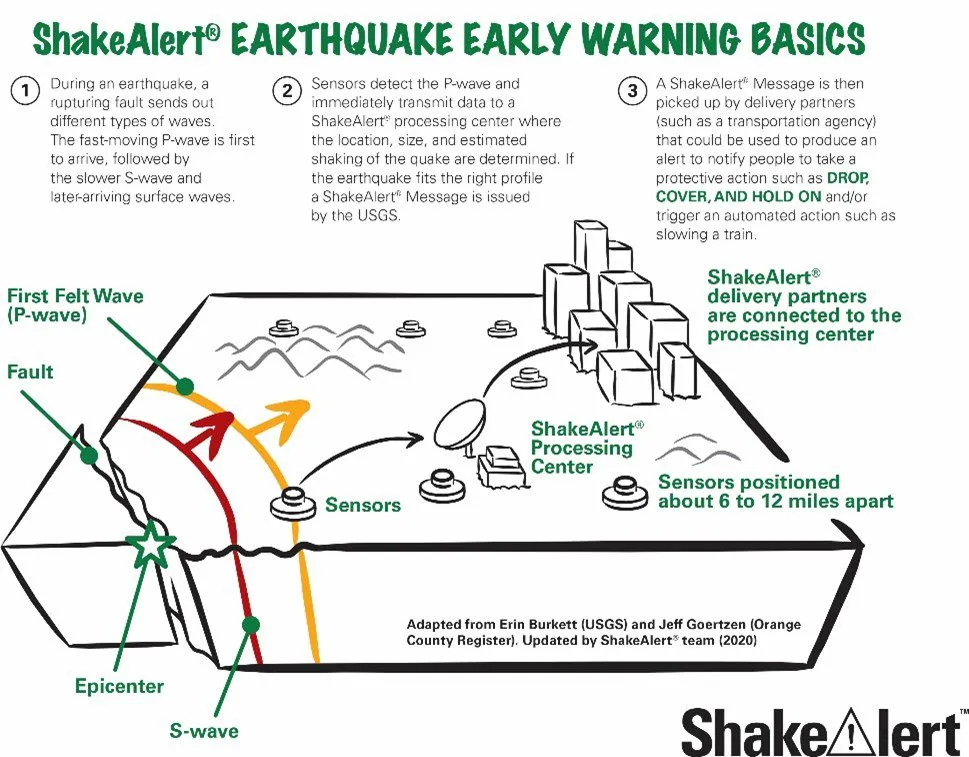

# Observational Seismology
# (Machine Learning Seismology)

---

[Latest Earthquakes](https://earthquake.usgs.gov/earthquakes/map/?extent=-88.45674,-106.875&extent=88.43769,506.25&range=month&magnitude=all&showUSFaults=true&baseLayer=ocean&settings=true)
- [California](https://earthquake.usgs.gov/earthquakes/map/?extent=30.78904,-128.58398&extent=43.05283,-109.42383&range=month&magnitude=all&showUSFaults=true&baseLayer=ocean&settings=true)
- [Alaska](https://earthquake.usgs.gov/earthquakes/map/?extent=45.3367,-190.2832&extent=74.04372,-113.64258&range=month&magnitude=all&showUSFaults=true&baseLayer=ocean&settings=true)
- [Hawaii](https://earthquake.usgs.gov/earthquakes/map/?extent=16.35177,-161.78467&extent=23.58413,-152.20459&range=month&magnitude=all&showUSFaults=true&baseLayer=ocean&settings=true)
- [Oklahoma & Texas](https://earthquake.usgs.gov/earthquakes/map/?extent=26.78485,-109.81934&extent=39.62261,-90.65918&range=month&magnitude=all&showUSFaults=true&baseLayer=street&settings=true)

---

[Seismic Networks](http://ds.iris.edu/gmap/#network=*&starttime=2023-01-01&datacenter=IRISDMC&plates=on&planet=earth)
- [California](http://ds.iris.edu/gmap/#network=*&starttime=2023-01-01&datacenter=NCEDC,SCEDC&plates=on&planet=earth)
- [Alaska](http://ds.iris.edu/gmap/#network=AV,AK&starttime=2023-01-01&plates=on&planet=earth)
- [Hawaii](http://ds.iris.edu/gmap/#network=HV&maxlat=20.3285&maxlon=-154.6436&minlat=18.7711&minlon=-156.389&drawingmode=box&plates=on&planet=earth)
- [Oklahoma & Texas](http://ds.iris.edu/gmap/#starttime=2023-01-01&maxlat=37.9407&maxlon=-95.4497&minlat=36.6472&minlon=-105.7109&network=*&drawingmode=box&plates=on&planet=earth)

---

### Large-N and Large-T challenge

[IRIS dataset](https://ds.iris.edu/data/distribution/)

---

### Mining the IRIS dataset

---

### What information can we get from seismic data?

- Take a look at a recent earthquake: [M 5.1 - 7 km SE of Ojai, CA](https://earthquake.usgs.gov/earthquakes/eventpage/ci39645386/executive)

---

### How are these information extracted/determined?

- Detection of the earthquake
- Earthquake origin time and location
- Earthquake magnitude
- Earthquake focal mechanism/moment tensor
- Shake map/ground motion prediction
- Earthquake early warning
- "Did you feel it?"

---

### What additional information can we glean from millions of earthquakes?

- Earthquake catalog
- Earthquake statistics
- Earthquake triggering
- Earthquake forecasting
- Fault zone structure
- Seismic tomography
- Volcano, glacier, and landslide monitoring

---

### How to use these information?

- Monitoring earthquakes and mitigate damage

- Understand earthquake source physics

- Understanding the Earth's structure

- Applying seismology to environmental science, planetary science, climate science, etc.

---

### Earthquake monitoring and earthquake rick?

- Before an earthquake
- A few seconds after an earthquake
- Hours/days after an earthquake
- Years after an earthquake

---

### Before an earthquake

- [Eathquake Hazard Map](https://earthquake.usgs.gov/earthquakes/map/?extent=27.95559,-130.8252&extent=51.28941,-92.50488&range=month&magnitude=all&showPopulationDensity=true&showUSHazard=true&settings=true)

---

- Simulating earthquake scenarios
[Hayward Fault Scenarios](https://earthquake.usgs.gov/education/shakingsimulations/hayward/)

---

### A few seconds after an earthquake

---

- MyShake
[https://myshake.berkeley.edu/](https://myshake.berkeley.edu/)

- Mobile phones as seismometers
[Android EEW](https://www.youtube.com/watch?v=zFin2wZ56tM&ab_channel=Android)

---

### Hours/days after an earthquake

- Emergency response and damage assessment
[Fault Dimensions](https://www.src.com.au/earthquake-size/)

| Magnitude Mw | Fault Area km² | Typical rupture dimensions (km x km) |
|--------------|----------------|--------------------------------------|
| 4            | 1              | 1 x 1                                |
| 5            | 10             | 3 x 3                                |
| 6            | 100            | 10 x 10                              |
| 7            | 1,000          | 30 x 30                              |
| 8            | 10,000         | 50 x 200                             |

--- 

- [Aftershock prediction](https://earthquake.usgs.gov/data/oaf/overview.php)

---

### Years after an earthquake

- Understand earthquake rupture process
- Earthquake forecasting model
- Improve ground motion prediction models (GMPE)
- Improve building codes

---

### How can we better monitor earthquakes?

**Instrument side**
(How to collect more and better data?)
- Dense seismic networks
- New sensors, such as, broadband seismometer, nodal array, and DAS (Distributed Acoustic Sensing)
- Remote sensing, LiDAR, etc.

--- 

### How can we better monitor earthquakes?

**Algorithm side**
(What techniques are used to process data and extract information?)

- Many signal processing algorithms, such as, template matching, cross-correlation, filtering, etc.

- Machine learning, in particular, deep learning

- Numerical simulation

- Inverse theory

- Statistical analysis

---

### Things to learn in this course

- Familiarize with seismic data
- Learn the state-of-the-art machine learning methods for seismic data processing
- Process seismic data, build seismic catalogs, and analyzing seismicity
- Learn basic inverse theory and apply it to earthquake location, seismic tomography, etc.

---

### The advantages of machine learning

Deep Learning (Deep Neural Networks) is a new paradigm of software development

- [Software 2.0](https://karpathy.medium.com/software-2-0-a64152b37c35)

- [Universal Approximation Theorem](https://en.wikipedia.org/wiki/Universal_approximation_theorem)

---

### Applications of deep learning in seismology

* Neural Networks
* Automatic Differentiation
* Optimization

---
