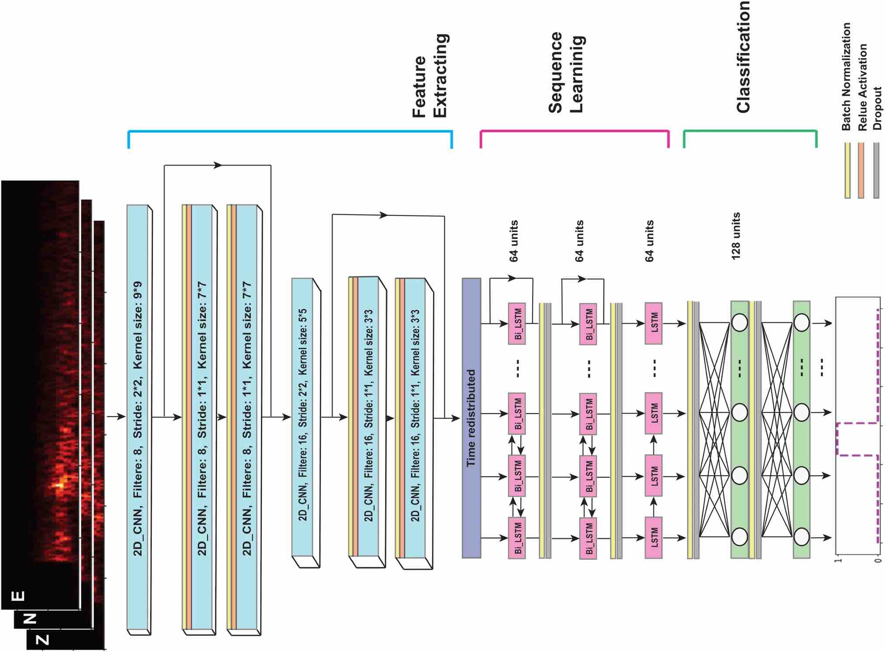

# Earthquake Detection
Notebooks: [codes/earthquake_detection.ipynb](codes/earthquake_detection/)

<!-- ---  -->

<!-- ### Download continuous seismic data

 -->

---

### How to detect earthquakes?

* Amplitude threshold
* STA/LTA
* Template matching / Matched filter
* Deep learning

---

### Amplitude threshold

- PGA (Peak Ground Acceleration)
- PGV (Peak Ground Velocity)
- Displacement

[Recent M4.5 earthquake](https://earthquake.usgs.gov/earthquakes/eventpage/nc73938736/executive)

---

### The Modified Mercalli Intensity Scale (MMI)

| Instrumental Intensity |  Acceleration (g)  | Velocity (cm/s) | Perceived shaking |  Potential damage |
|:----------------------:|:------------------:|:---------------:|:-----------------:|:-----------------:|
| I                      | < 0.000464         | < 0.0215        | Not felt          | None              |
| II–III                 | 0.000464 – 0.00297 | 0.135 – 1.41    | Weak              | None              |
| IV                     | 0.00297 – 0.0276   | 1.41 – 4.65     | Light             | None              |
| V                      | 0.0276 – 0.115     | 4.65 – 9.64     | Moderate          | Very light        |

--- 

| Instrumental Intensity |  Acceleration (g)  | Velocity (cm/s) | Perceived shaking |  Potential damage |
|:----------------------:|:------------------:|:---------------:|:-----------------:|:-----------------:|
| VI                     | 0.115 – 0.215      | 9.64 – 20       | Strong            | Light             |
| VII                    | 0.215 – 0.401      | 20 – 41.4       | Very strong       | Moderate          |
| VIII                   | 0.401 – 0.747      | 41.4 – 85.8     | Severe            | Moderate to heavy |
| IX                     | 0.747 – 1.39       | 85.8 – 178      | Violent           | Heavy             |
| X+                     | > 1.39             | > 178           | Extreme           | Very heavy        |

---

| PGA       | Magnitude  | Depth | Fatalities  |             Earthquake             |
|:---------:|:----------:|:-----:|:-----------:|:----------------------------------:|
| 3.23g    | 7.8        | 15 km | 2            | 2016 Kaikoura earthquake           |
| 2.7g     | 9.1        | 30 km | 19,759       | 2011 Tōhoku earthquake             |
| 1.92g    | 7.7        | 8 km  | 2,415        | 1999 Jiji earthquake               |
| 1.82g    | 6.7        | 18 km | 57           | 1994 Northridge earthquake         |
| 1.62g    | 7.8        | 10 km | 57,658       | 2023 Turkey–Syria earthquake       |
| 0.65     | 6.9        | 19 km | 63           | 1989 Loma Prieta earthquake        |

---

### Amplitude threshold

* Pros:
    - Simple and fast
    - Physical parameter
    - Directly related to shaking/damage
* Cons:
    - Limit to large earthquakes
    - Need backgroud noise level for small earthquakes
* Improvments:
    - How to make the threshold adaptive to the background noise level?

---

### STA/LTA

- STA/LTA = Short-Term Average / Long-Term Average

---

### STA/LTA

---

### STA/LTA

* Pros:
    - Simple and fast
    - More sensitive than amplitude threshold
    - More robust for noisy data

* Cons:
    - More parameters for tuning
    - Prone to false detections

---

### Template matching / Matched filter

Review of convolution and cross-correlation in last lecture: [cross-correlation](https://ai4eps.github.io/EPS207_Observational_Seismology/lectures/02_signal_processing.html#12)

Notebook: [cross-correlation](https://ai4eps.github.io/EPS207_Observational_Seismology/lectures/codes/signal_processing/#convolution)

---

### (QTM) Quake Template Matching

--- 

### Template matching / Matched filter

- Pros:
    - Robust to noise
    - More sensitive to small earthquakes
- Cons:
    - High computational cost
    - Need existing catalog to build templates
    - Limited to waveform similarity with templates

---

### Similarity search

<!--  -->

--- 

### FAST (Fingerprint And Similarity Thresholding)

--- 

### Siminlarity search

- Pros:
    - Sensitive to small earthquakes
    - Computational efficient
- Cons:
    - Detect all repeating signals
    - Complex to implement

---

### Deep learning

- Generalized similarity search

---

### Convolutional Neural Network for Earthquake detection and location

--- 
### Residual Network of Convolutional and Recurrent Units for Earthquake Signal Detection

---
### Deep learning

- Pros:
    - Robust to noise
    - Sensitive to small earthquakes
    - Fast prediction
- Cons:
    - Need large amount of labeled data
    - Black box
    - Generalization ability
