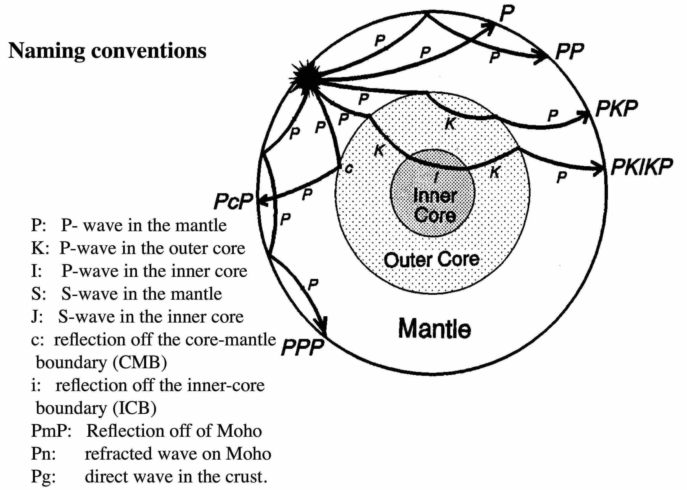
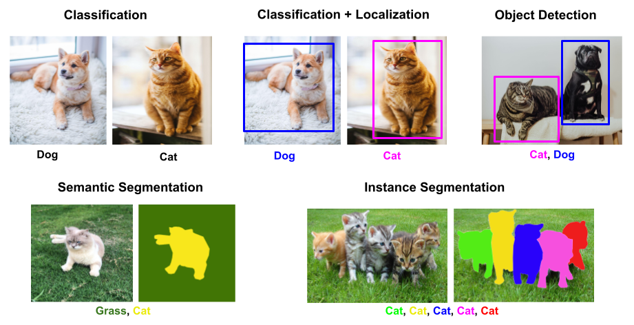
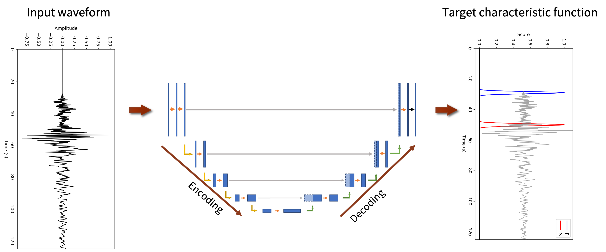
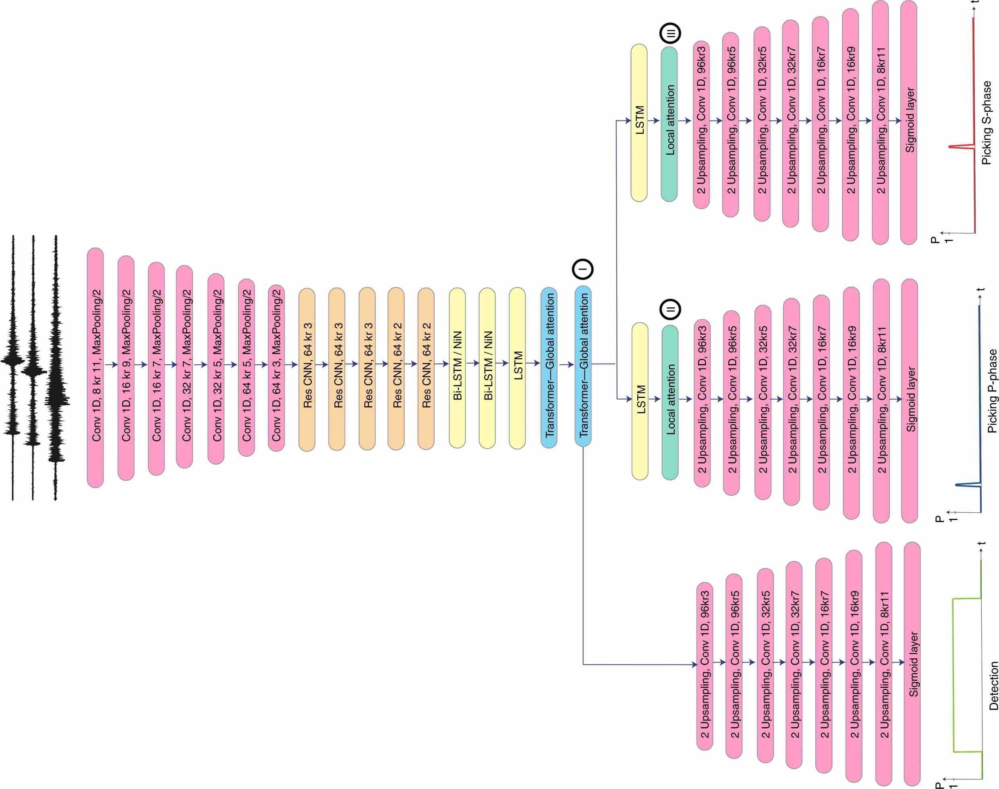
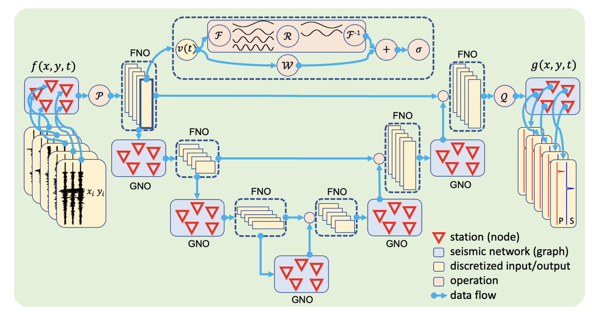
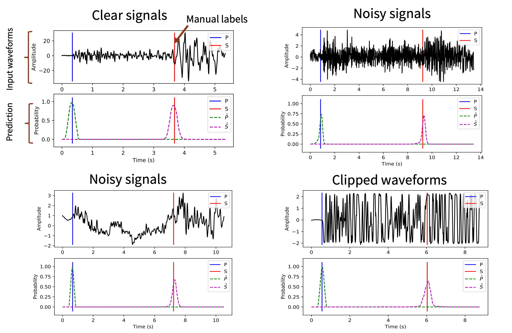

# Phase Picking

Notebooks: [codes/quakeflow_demo.ipynb](codes/quakeflow_demo/)

---

### Seismic waves

---

### Seismic phases

---

<!--  -->

---

<!--  -->

---

<!-- https://sites.ualberta.ca/~ygu/courses/geoph624/notes/lecture3-4_2013.pdf -->

---

### Information from seismic phases

* Earthquake source
* Earth's (Planetary) interior structure
* Subsurface exploration (reservior, geothermal, etc.)
* ...

---

### Picking P and S waves

---

### Background: Semantic Segmentation vs. Classification

---

---

---

---

---

### Demo: Segment Anything Model (SAM)

Try the SAM model: [link](https://segment-anything.com/demo)

---

### How to apply deep learning to seismic phase picking?

---

### Generalized seismic phase detection with deep learning

---

### PhaseNet

---

### EQTransformer for simultaneous earthquake detection and phase picking

---

### Next-Generation Seismic Monitoring with Neural Operators (PhaseNO)

---

### Large training dataset + Clear objective function

---

---

**How to design the next model for detecting earthquake / picking seismic phases?**
**What other seismic tasks can be solved with deep learning?**
**What are other potential applications in Earth and Planetary Science?**