

# Earthquake Statistics

Two class project datasets:

- [Nodal Seismic Experiment at the Berkeley Section of the Hayward Fault](https://pubs.geoscienceworld.org/ssa/srl/article/93/4/2377/613344/Nodal-Seismic-Experiment-at-the-Berkeley-Section) (Taka'aki et al. 2022)

- An island on Mid-Atlantic Ridge: [Networks](http://ds.iris.edu/gmap/#maxlat=73.3732&maxlon=-1.582&minlat=68.7841&minlon=-15.1596&network=*&drawingmode=box&planet=earth), [Seismicity](https://nnsn.geo.uib.no/nnsn/#/)

---

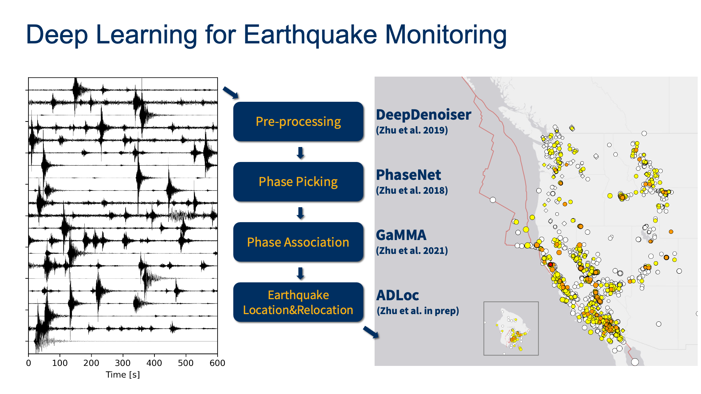

---

### Earthquake Source Parameters

- Magnitude
- Origin time
- Location
- Focal mechanism
- Stress drop
- Energy
- Frequency
- ...

---

### Statistical relationship between source parameters

[wiki](https://en.wikipedia.org/wiki/Aftershock)
- Gutenberg-Richter Law (1944)
- Omori Law (1894)
- Båth's Law (1965)
- The Epidemic Type Aftershock Sequence (ETAS) model (1988)
- ...

---

### The Gutenberg-Richter Law

$$
N=10^{a-b M}
$$
Where:
- $N$ is the number of events greater or equal to $M$
- $M$ is magnitude
- $a$ and $b$ are constants

---

### The Gutenberg-Richter Law

<!-- footer: (Hutton et al. 2010) -->

---

### The Gutenberg-Richter Law
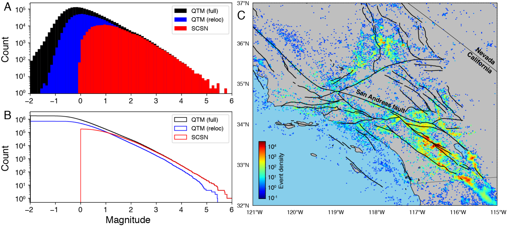
<!-- footer: (Ross et al. 2019) -->

---

### What controls the slop $b$?

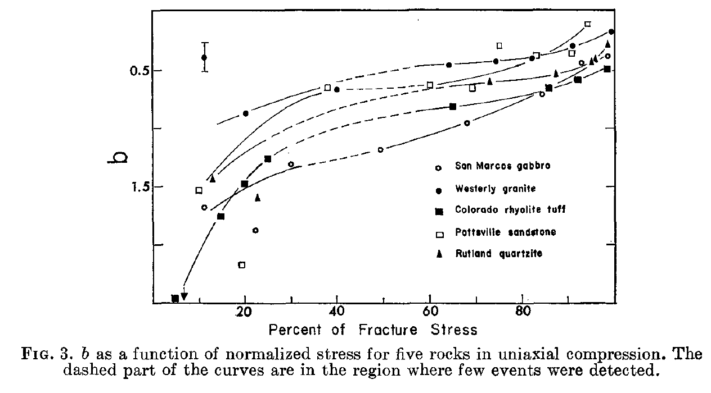
<!-- footer: (Scholz 1968) -->

---

### Temporal variation of $b$

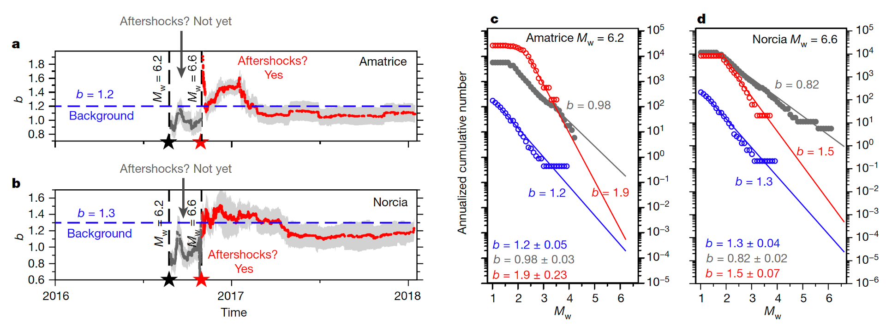
<!-- footer: (Gulia and Wiemer 2019) -->

---

### Temporal variation of $b$

---

### The magnitude completeness ($M_c$)

What affects the magnitude completeness?

* Station coverage
* Background noise
* Detection algorithms
* ...

<!-- footer: (Hutton et al. 2010) -->

---

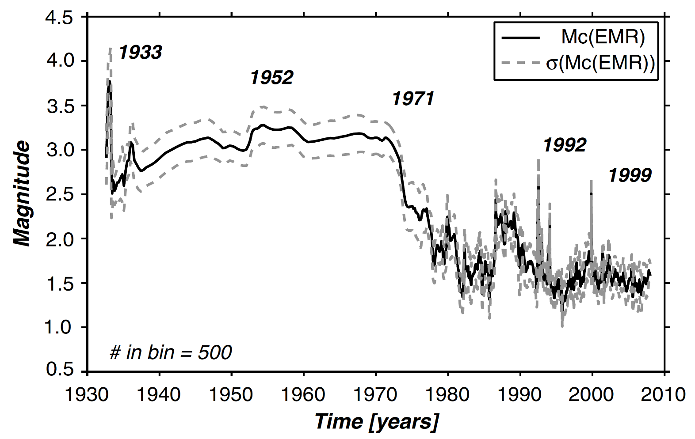
<!-- footer: (Hutton et al. 2010) -->

---
### Omori Law

$$
n(t) = \frac{K}{c+t}
$$
The number of events $n(t)$ in time $t$ after the mainshock

<!-- footer: (Omori 1894) -->
---

### A modified Omori Law

$$
n(t) = \frac{K}{(c+t)^p}
$$
𝐾: productivity of aftershocks
𝑝: decay rate
c: delay time

<!-- footer: (Ogata 1983) -->

---

### The decay rate $p$

- $p \sim 1.1$
- valid for a long time range
- independent of magnitude

<!--  -->
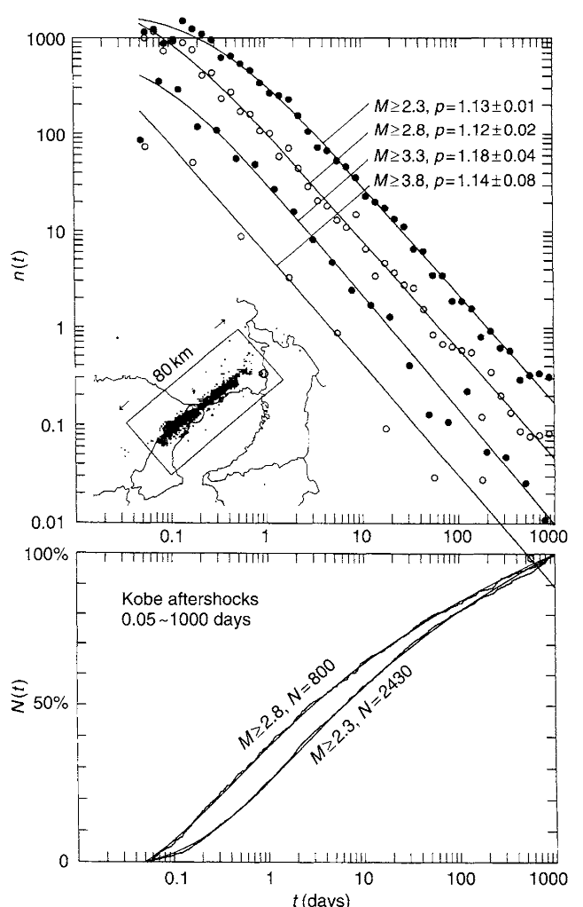

<!-- footer: (Utsu 2002) -->

---

### The aftershock productivity $K$

- Combined with the Gutenberg-Richter law

$$
K = K_0 10^{b (M_{main} - M)}
$$

$$
n(t, M) = \frac{10^{a + b (M_{main} - M)}}{(c+t)^p}
$$

<!-- footer: (Reasenberg and Jones 1989) -->

---

### How about for foreshocks?

* Inverse Omori law $n(t) \propto t^p$

* but individual sequences rarely display this behavior

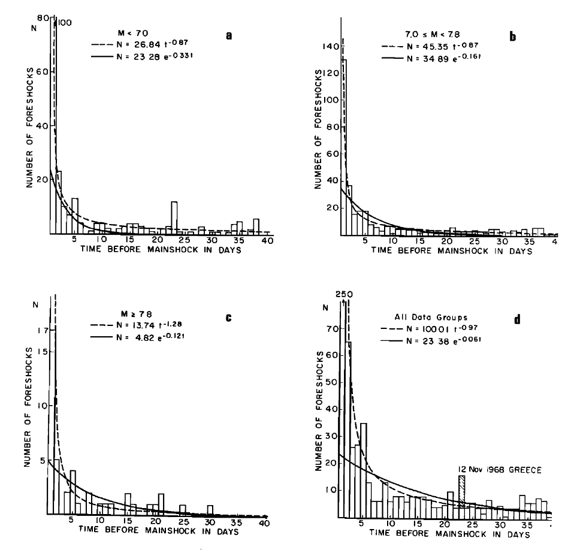

<!-- footer: (Jones and Molnar 1979) -->

---

### The Epidemic Type Aftershock Sequence (ETAS) model

$$
% g\left(t-t_i, M ; \theta\right)=\frac{K \cdot \exp \left(\beta\left(M-M_c\right)\right)}{\left(t-t_i+c\right)^p}
\lambda(t)=\mu+\sum_{t_i<t} K \cdot \exp \left(\beta\left(M-M_c\right)\right) \cdot\left(t-t_i+c\right)^{-p}
$$
- $\mu$ is the background rate
- $K$ is the productivity
- $M_c$ is the magnitude completeness
- $p$ is the decay rate
- $c$ is the delay time
- $\beta$ is the magnitude scaling
- $t_i$ is the occurrence times of previous earthquakes.

<!-- footer: (Ogata 1988) -->

---
### The ETAS model

- Modeling earthquake activity of a Poissonian background and a cluster process
- Analyzing “background” or “clustered” events
- Most widely used model for earthquake forecasting

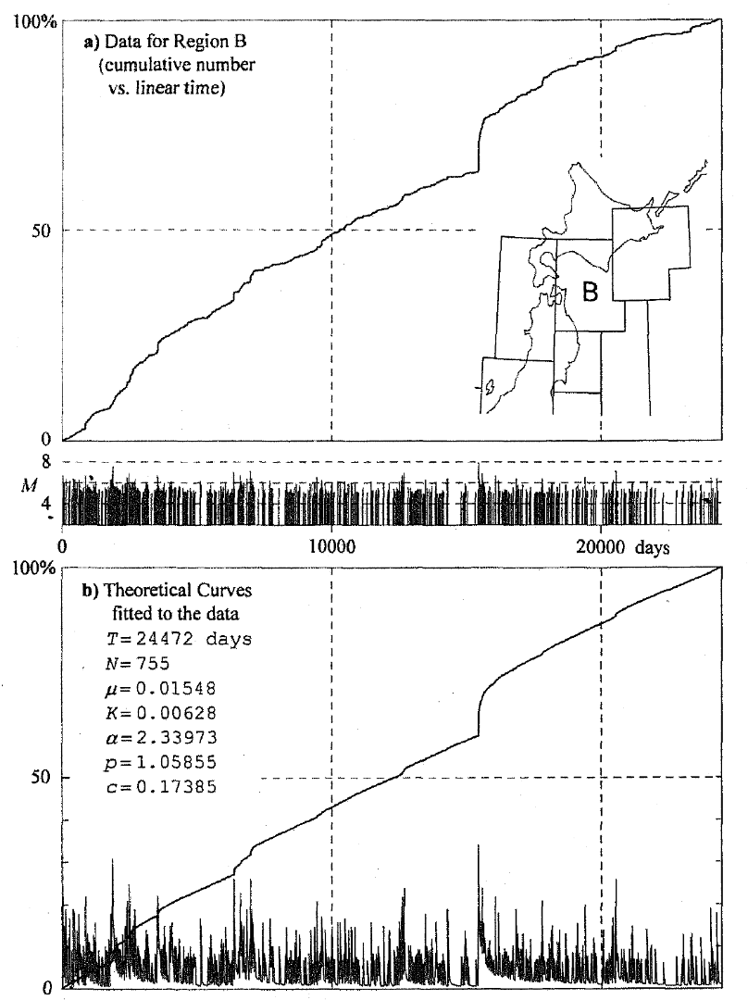

<!-- footer: (Utsu et al. 1995) -->

---

### Incorporate spatial triggering into ETAS

$$
\lambda(x, y, t \mid \mathcal{H})=\mu+\sum_{t_i<t} \frac{K \cdot \exp \left(\beta\left(M-M_c\right)\right)}{\left(t-t_i+c\right)^p} \cdot \frac{1}{\left(x^2+y^2+d\right)^q}
$$

- $q$: the spatial decay rate of intensity following an event

<!-- footer: (Ogata 1998) -->

---

### Physical models on aftershocks spatial distribution

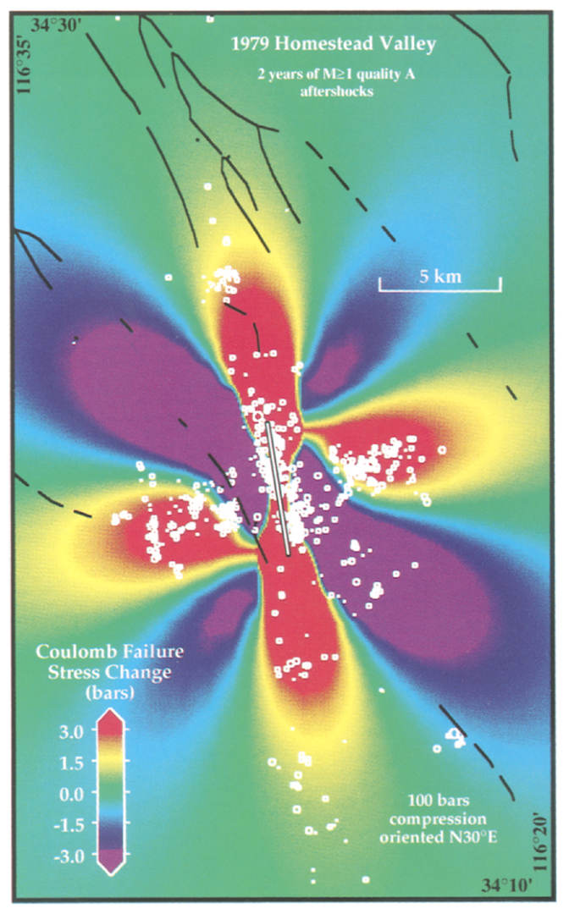
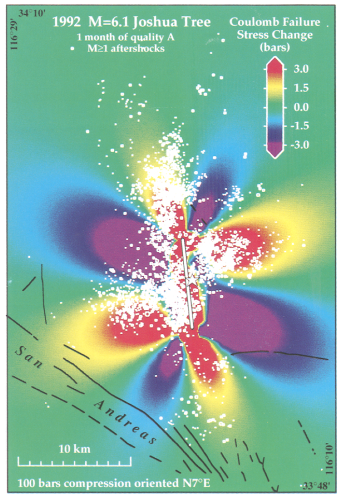

<!-- footer: (King et al 1994) -->

---

### Coulomb failure stress (CFS) (Static triggering)

$$
\Delta \sigma_f=\Delta \tau+\mu\left(\Delta \sigma_n+\Delta p\right)
$$
$\Delta \tau$ : change in shear stress
$\Delta \sigma_n$ : change in normal stress (positive for tension)
$\Delta p$ : change in pore pressure
$\mu$ : friction coefficient

<!-- footer: (Stein and Lisowski 1983) -->

---

### Coulomb failure stress (CFS)

<!-- footer: (King et al 1994) -->

---

### Dynamic triggering

<!-- footer: (Hill et al. 1993) -->

---

### Dynamic triggering

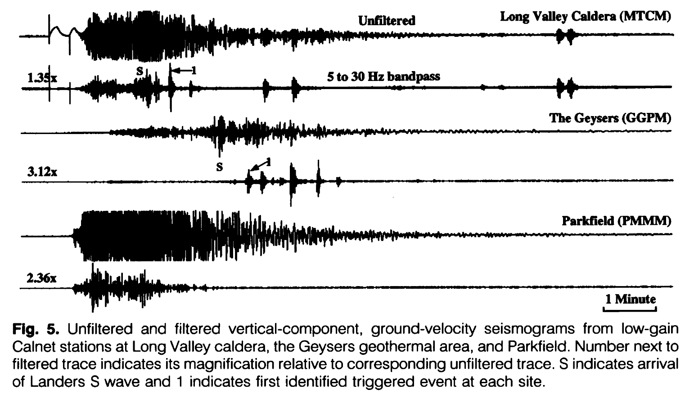

<!-- footer: (Hill et al. 1993) -->

---

### Earthquake swarms

“[a sequence] where the number and the magnitude of earthquakes gradually increase with time, and then decreases after a certain period. There is no single predominant principal earthquake” - Mogi (1963)

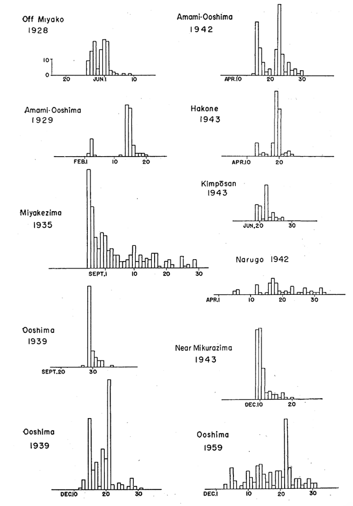

<!-- footer: "" -->

<!-- ### Clustering analysis of earthquakes

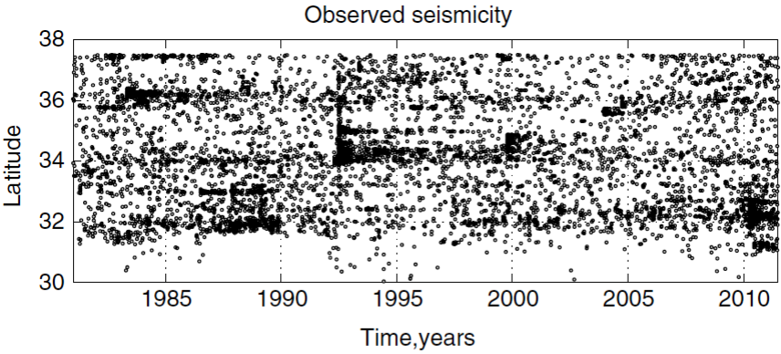 -->

---

**2012 Brawley,CA swarm**
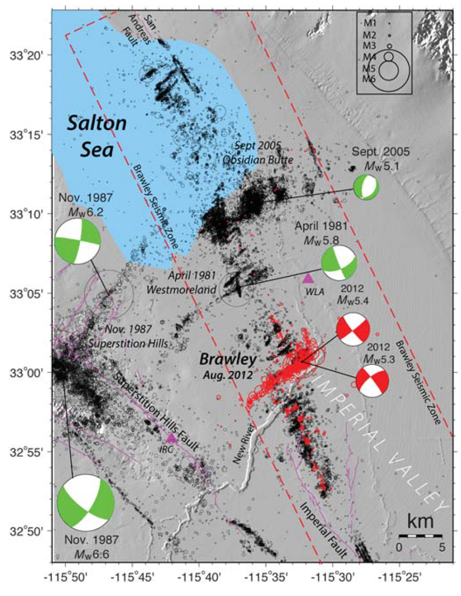

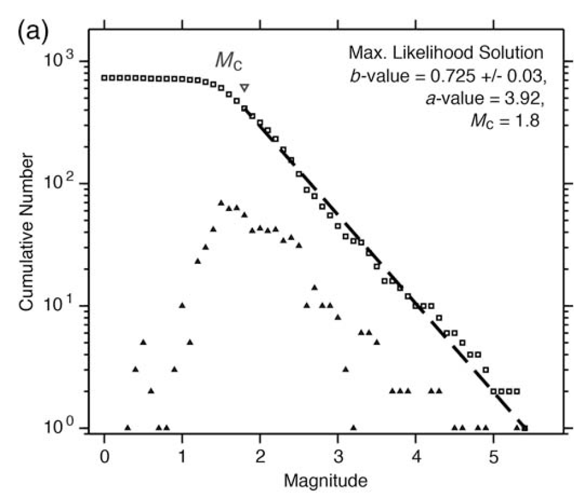

<!-- footer: (Hauksson et al. 2013) -->

---

**2016 Cahuilla,CA swarm**

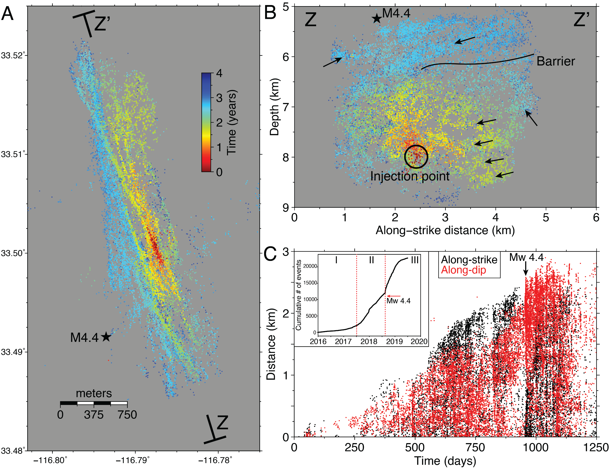

<!-- footer: (Ross et al. 2020) -->

---

**2018 Pahala,Hawaii swarm**

<!-- footer: (Wilding et al. 2020) -->

---

**2018 Pahala,Hawaii swarm**

<!-- footer: (Wilding et al. 2020) -->

---

### Spatial-temporal evolution patterns of swarms

- Migration distance vs. time
    - $R \propto t^{\alpha}$, $\alpha \sim 0.5, 1$
    - $R \propto \log(t)$

- Migration speeds
    - m/day to km/hour

- Similarity to induced seismicity
<!-- **Aggregating 18 swarms in southen California**

 -->

<!-- footer: "" -->

---

### Deep learning for earthquake statistics

<!-- footer: "Deep learning of aftershock patterns following large earthquakes, Devries et al. 2018" -->

---

### Deep learning for earthquake statistics

<!-- footer: "Using Deep Learning for Flexible and Scalable Earthquake Forecasting, Kelian et al. 2013" -->

---

### Deep learning for earthquake statistics

<!-- footer: "Using Deep Learning for Flexible and Scalable Earthquake Forecasting, Kelian et al. 2013" -->

